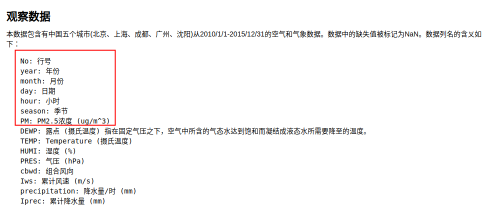
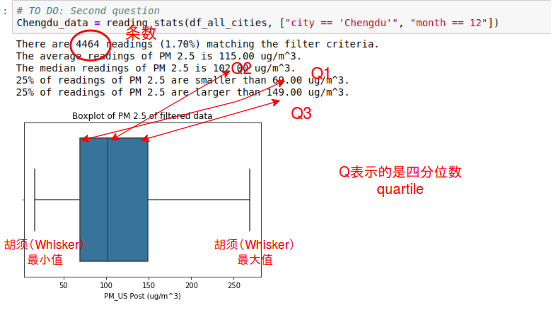

## PM2.5项目通关指南
这里的内容都**很重要**哦，一定要看!！!
### 1.注意事项
- 推荐使用Chrome或者火狐浏览器
- 看似代码很多，但是其实主要通过复制加替换就可以完成项目了
- 本项目主要是让大家体验数据分析流程, 因此只需理解对、每部分代码功能就好，如果你**不知道代码的含义或者对某些地方的代码感兴趣**，请私聊与我探讨
- 还记吗?开班上说的:**要在英文环境下编辑代码**。
- **特别注意:**当你重新打开项目网页时，需要从最开始的代码框按照顺序重新运行一遍，要不然就会出现明明之前定义了的变量，却提示没定义。


### 2.观察数据

在提出问题时要**注意**以下二点：
* 所提问题应该和PM2.5相关
* 因为考虑到项目的**体验性**，最终筛选的数据只包含红框的数据和城市，因此所提问题应该从以上维度进行提问。

示例：
2015年成都PM2.5在不同月份上有什么变化趋势？  
 成都市12月份里一天的PM2.5的变化趋势？

### 3.数据评估
这里我们将根据所提的问题对相应的数据集进行一个简单的认知。只需要将相应的文件名填入`pd.read_csv()`中，运行代码则可。这样就可以*回答问题２*。　　

需要的注意有两点:　　
* 文件名除了前面的城市名不一样，其他部分都相同，因此可以采用复制加小修的方法。比如我的问题就可以将`Shanghai`改成`Chengdu`如图。
* 城市首字母大写同时整个文件名用单引号括起来。　　

 
#### 拓展
在计算缺失值时，我们可以采取的二种简便方法直接计算所有列缺失的条数。
* 运用`for`循环将每个列按照示例进行处理
```python
for c in Shanghai_data.columns:
    print("The number of missing data is {} records in {}"
          .format(len(Shanghai_data.index) - len(Shanghai_data[c].dropna()),c))
```
* 直接运用函数进行求解
```python
Shanghai_data.isnull().sum()
```

### 4.数据整理
这一部分的代码的主要功能是将五个城市的数据组合在一个`DataFrame`中。这里大家不必纠结于细节，能理解其功能是什么就好。深入的学习会在正式班中接触的。下面是相应代码的注释帮助大家理解。
```python
# 定义一个由各个城市文件名组成的列表
files = ['BeijingPM20100101_20151231.csv',
       'ChengduPM20100101_20151231.csv',
       'GuangzhouPM20100101_20151231.csv',
       'ShanghaiPM20100101_20151231.csv',
       'ShenyangPM20100101_20151231.csv']

# 定义一个由需要保留的列名组成的列表
out_columns = ['No', 'year', 'month', 'day', 'hour', 'season',  'PM_US Post']
```
```python
# 创建一个新的ＤataFrame
df_all_cities = pd.DataFrame()
```
```python
# 循环对每个文件进行处理，将所有城市的数据组成一个新的ＤataFrame
for inx, val in enumerate(files):
    df = pd.read_csv(val)
    # 提取出需要保留的列进行保存
    df = df[out_columns]
    # 创建一个新的列来保存某条数据属于哪个城市
    df['city'] = val.split('P')[0]
    print(val.split('P'))
    # 对season这一列进行映射操作：将１换成Ｓpring,将２换成Summer
    df['season'] = df['season'].map({1:'Spring', 2:'Summer', 3:'Autumn', 4: 'Winter'})
    # 将处理完的数据添加到df_all_cities
    df_all_cities = df_all_cities.append(df)
```
### 5.数据筛选
这里定义了两个函数：

> **filter_data(data, condition)**:这个函数的功能是将data中满足condition的数据保留下来。这里condition对应这某一个条件。  
> **reading_stats(data,filters=[],verbose=True)**:这个函数的功能是将data中满足filters(多个condition)的数据筛选出来，同时对求其相关统计值并画出箱线图。　　

但是我们使用的函数只有reading_stats，它与filter_data的关系在于:它利用filter_data来分别处理filters里的多个condition，最终得到了满足所有条件的数据(如图所示)。　　

 

因此我们就可以根据提出的问题，弄清楚我们到底需要哪些条件了!　比如我们第一个问题　*2015年成都PM2.5在不同月份上有什么变化趋势？*条件就应该是`year`要等于2015,`city`要等于"Chengdu";因此我们将key变成下面的就好了。
```python
df_1 = reading_stats(df_all_cities, ["city == 'Chengdu'", "year == 2015"])
```
我的第二个问题是*  成都市12月份里一天的PM2.5的变化趋势？*，因此筛选的函数就变成下面样子了。
```python
df_2 = reading_stats(df_all_cities, ["city == 'Chengdu'", "month == 12"])
```
**注意:**　　

- **城市名**要放在**单引号**内
- **比较运算符两边都要添加一个空格**　　

下图展示了函数的可视化结果与其意义：　　　　

 　　

根据打印出的结果和可视化你就可以回答**问题３**了。
#### 拓展
如果你提的问题是比较两个城市的差别，那么筛选条件就反向写吧，比如你要比较成都和沈阳，那么条件就变成`["city ！= 'Beijing'", "city ！= 'Guangzho'", "city == 'Shanghai'"]`
### 6.数据探索性分析
**univariate_plot(data, key = '', color = 'blue')：** 这个函数的功能是将data_(将data换成你筛选后的数据集)_按key_(将key = '‘换成你要分析的维度，比如month,year,hour,city)_进行分组，然后求均值，最后进行可视化。　　　　

如我的第二问题* 成都市12月份里一天的PM2.5的变化趋势？*　探索如下图所示是将`df_２`根据`hour`的值进行分组，然后求出每个组的平均值，`X`轴显示的是分组情况，`Y`轴显示的每个分组的平均值。这就可以分析出变化趋势了。
```python
univariate_plot(df_2, 'hour')
```
注意：`hour`要加单引号。　　

 

这样第４个问题就很好回答了。
### 7.结论
还有**问题５**别忘了,根据自己的经历发挥脑洞或者来一场头脑风暴就可以了。

### 8.提交项目
- 在`File`中，保存两种格式的文件：html和ipynb到本地。


- 将两个文件打一个**zip**格式的压缩包，注意压缩包的**文件名不要出现中文或者空格**

- 按照提示提交项目即可，**注意：提交项目时记得把教室的语言设置为中文**

  